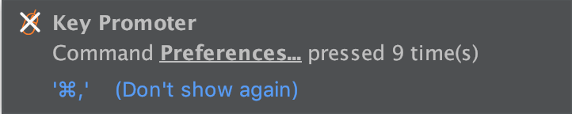
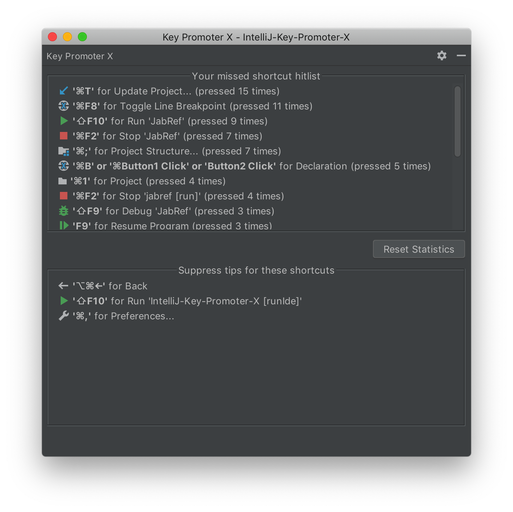
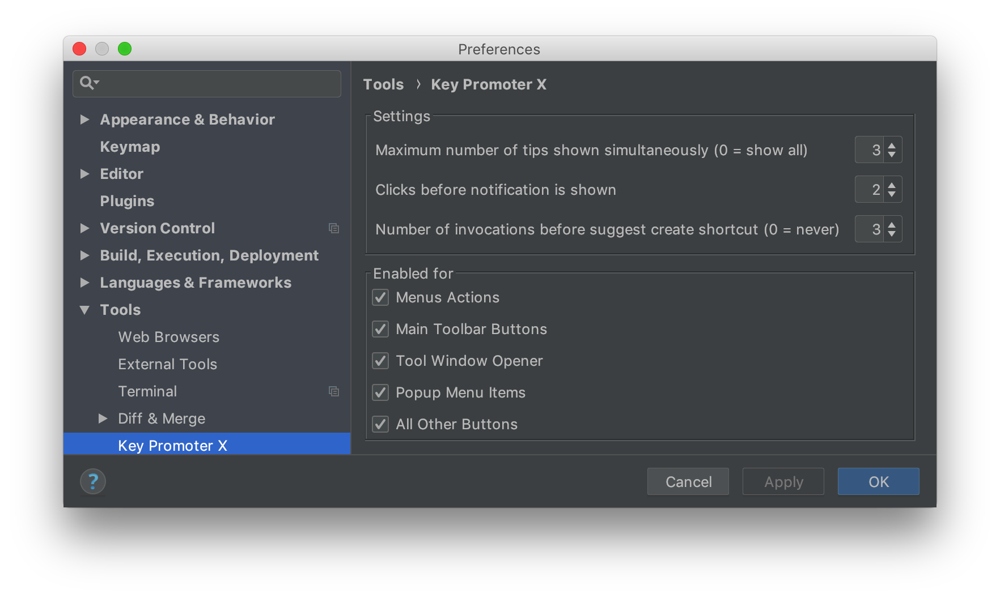

---
I'm grateful this project is currently sponsored by 

and receives $4/month from
[Daniel Babiak](https://github.com/dbabiak), 
[Stefan Hagen](https://github.com/sthagen), 
[Joshua Lückers](https://github.com/JoshuaLuckers),
[jlash13](https://github.com/jlash13),
[Mark McCorkle](https://github.com/mccorkle),
$2/month from
[Mac Adamarczuk](https://github.com/macalac),
[Frank Harper](https://github.com/franklinharper), 
[Christopher Kolstad](https://github.com/chriswk),
[Søren Berg Glasius](https://github.com/sbglasius),
[Sudhir Jonathan](https://github.com/sudhirj),
[Hasnain Baxamoosa](https://github.com/hbaxamoosa),
[James Haskell](https://github.com/JamesHaskell),
[Ryan Quinn](https://github.com/ryanwilliamquinn),
and $1/month from [21 other people](https://github.com/sponsors/halirutan).

- [Become a GitHub Sponsor and support the Key Promoter X development](https://github.com/sponsors/halirutan)

---

The Key Promoter X is a plugin for IntelliJ-based products like IDEA, Android Studio, or CLion, and it helps to learn
essential keyboard shortcuts from mouse actions while you are working.
When you use the mouse on a button inside the IDE, the Key Promoter X shows you the keyboard shortcut that you should
have used instead. This provides an easy way to learn how
to replace tedious mouse work with keyboard keys and helps to transition to a faster, mouse free development.
Currently, it supports toolbar buttons, menu buttons, tool windows and the actions therein.

## ![Docs][doc-image] Features and Documentation

### Features

- non-intrusive notifications about shortcuts using IDEA's built-in message framework
- easy shortcut customization for buttons by active links in the notification
- easy creation of shortcuts for buttons that don't have one
- a persistent hit-list of missed shortcuts as IDEA tool-window
- list of suppressed tips for certain shortcuts you don't want to use

## Installation

The plugin can be installed with **Settings | Plugins | Market Place** and searching for Key Promoter X. When a button is
clicked with the mouse, a notification pops up that shows the shortcut which can be used instead. If a button has no shortcut and
is pressed several times, a notification is shown that lets you easily create a shortcut for this action.

## Documentation

### How does it work?

If you click something with the mouse, the plugin will try to find out if your mouse-click invoked some IDEA action. If this is the case
and we can find a so-called `ActionID`, the plugin registers this event. If your action is already connected to a shortcut, the plugin will
show you how the invoked action is called (e.g. Open Settings) and what the shortcut for the action is. 

Additionally, it will save your mouse-click
in the Key Promoter X statistics tool-windows so that you see which actions you are using the most and which shortcuts you should learn first.

If the action is not connected to a shortcut but has an `ActionID` (which basically means we can assign a shortcut), the plugin still registers
your click. Depending on your settings under **Settings | Tools | Key Promoter X**, you will get a notification every x clicks on the
same action that asks you if you want to create a shortcut for this.

Be aware that there are certain mouse-clicks that, although they do something, cannot be successfully inspected and the plugin won't be able
to help you with those. This for instance happens for some of the buttons in the tool-windows.

### The Key Promoter X tool-window

The Key Promoter X comes with built in tool-window on the right side that gives you access to your hit-list of missed shortcuts and to the
the list of suppressed items.

Every mouse click that is connected to an action with a shortcut will be registered in the statistic. The items in this list are ordered by
 how often you missed this shortcut.
 
There might be some mouse actions that you don't want to replace by its shortcut.
For those, you can press *Don't show again* in the notification and all suppressed shortcuts will appear in the list below the statistics.
You can re-activate a suppressed item by double-clicking on it in the suppressed list.

The Key Promoter X toolwindow additionally allows you to clear your statistics and make a fresh start, and you can
snooze the Key Promoter X notification until the restart of IDEA (or you turn it off again).

### Settings for the Key Promoter X

 Settings for the plugin can be found under **Settings | Tools | Key Promoter X**.

#### General

- Show only keyboard shortcuts prevents the display of notifications of short-cuts for the mouse. One example is the
*Go to declaration* action, which also has certain mouse combination to invoke the action. Enabling this option will
only show valid keyboard short-cuts.
- Disable in presentation or distraction free mode will disable the Key Promoter X when you are giving a presentation or
you explicitly don't wan to be disturbed.

#### Settings

- Clicks before notification is shown adjusts whether the Key Promoter X should display a notification each time you press
a button with the mouse that has a key combination available.
E.g., with a setting of 2, every second click will show a notification.
- Number of invocations before suggesting to create adjusts how often a button without a short-cut needs to be clicked
before you see a message suggesting to create one for it.

#### Enable for

Adjusts which buttons are allowed to show a tip. Note that the *All Buttons* checkbox will try
to catch as many mouse-clicks as possible, even if you are not pressing a real button. This will show you for instance a tip when you
hold Ctrl and press on a Java method to jump to its declaration which can be replaced by Ctrl+B.

## ![dev image][dev-image] Development  

The plugin is written in Java using IntelliJ's plugin framework.
The code-base is small and contains only a handful of well documented classes, which makes it an excellent candidate to 
learn how to implement IntelliJ plugins.

The code is hosted on GitHub and has a [Travis-CI](https://travis-ci.org/) integration for automatic building.
Compilation is done with Gradle using the IntelliJ Gradle plugin and should work out of the box with a recent (v3.5) version.

## ![bug image][issues-image] Reporting issues

If you experience bugs or weird behavior please create an issue [on the bug tracker](https://github.com/halirutan/IntelliJ-Key-Promoter/issues).

## ![contact image][contact-image] Credits

The initial version was [implemented by
Dmitry Kashin](https://code.google.com/p/key-promoter/)
who unfortunately stopped maintaining the code and pushed the
last version in 2012, more than 7 years ago.

[User athiele](https://github.com/athiele/key-promoter-fork/commits/master)
took the time to fork the original code, fix issues and provide
a version that can be used on more recent IDEA versions but stopped working on it a few years ago.

[logo-image]: http://i.imgur.com/p3u3ehU.png
[doc-image]: http://i.stack.imgur.com/erf8e.png
[dev-image]: http://i.stack.imgur.com/D9G2G.png
[issues-image]: http://i.stack.imgur.com/K4fGd.png
[contact-image]: http://i.stack.imgur.com/tCbmW.png
